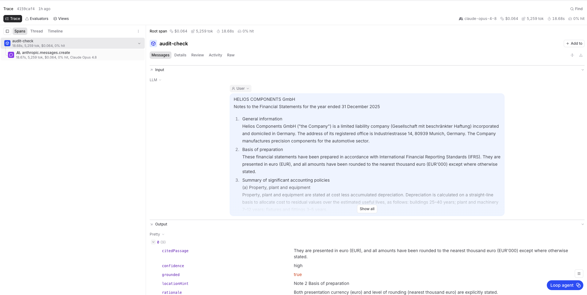

# Audit Quality Agent — IFRS Disclosure Completeness

**A working slice of Cortea's "Audit Quality Agent", built from scratch as a work-sample for the AI Product Manager role.**

It takes a financial-statement notes document and checks it against a named set of IFRS disclosure requirements — returning per-requirement findings that are **standards-grounded, evidence-anchored, and auditor-in-the-loop**, backed by an **evaluation** that measures the failures auditors actually care about.

> Built on Anthropic Claude — the same foundation-model layer Cortea describes itself sitting on top of. The point isn't "an LLM reads a statement"; it's the **harness that makes the output defensible at sign-off.**

---

## ▶ Try it live

- **The checker** — https://audit-quality-agent-poc.vercel.app
  Pick a sample company → **Run completeness check** → **↓ Download report** (a self-contained HTML/PDF you can keep or share).
- **The evaluation** — https://audit-quality-agent-poc.vercel.app/eval
  Precision/recall on a labelled test set, with the planted traps that separate a real checker from a naive one.

*(Two synthetic statements are built in — Helios Components GmbH and Northwind Logistics plc — each engineered to contain deceptive cases. No upload needed.)*

---

## What it does

External auditors are personally accountable at sign-off, yet disclosure-completeness review is manual and easy to get wrong under time pressure — in two specific directions:

- **Missed gap (false negative):** a note *exists* but is materially incomplete (e.g. a related-party note with no key-management compensation). The dangerous error — it survives to sign-off.
- **False alarm (false positive):** a disclosure is flagged as missing when it's simply in a different section (e.g. depreciation policy in accounting policies, not the PP&E note). The adoption-killer — it trains auditors to ignore the tool.

For each requirement the agent returns a **status** (`satisfied` / `gap` / `needs_review`), the **verbatim evidence** it relied on, the **exact standard clause** it tested against, a **confidence**, and a one-line rationale.

## The three trust mechanics (the actual product)

1. **Standards-grounded, not open-ended.** Each requirement is a *closed question* against its named clause (*does this satisfy IAS 24.17?*) — not "find problems." Bounded scope, closed question.
2. **Evidence-anchored, with grounding enforced in code.** Every non-gap conclusion must quote the verbatim source passage; a **code-side check then verifies that quote actually exists in the document** and rejects it if not ([`lib/checkEngine.ts`](lib/checkEngine.ts)). *"No hallucination" is verified, not promised.*
3. **Completeness, not presence — auditor in the loop.** A note that exists but is incomplete is a `gap`; ambiguity returns `needs_review`. The agent flags and cites; **the auditor reviews, approves, and signs.** No audit opinion is ever issued by the model.

## The evaluation — why it's the part that matters

A demo that flags some gaps proves nothing. The hard question is *how often it's wrong, and in which direction.* The harness ([`eval/`](eval/)) scores the agent's verdicts against a hand-written answer key and calls out **three planted traps** by name. Latest snapshot (rendered live at [`/eval`](https://audit-quality-agent-poc.vercel.app/eval)):

| Metric | Result |
|---|---|
| **Recall** (real gaps caught) | **100%** |
| **Precision** (flags that are real) | **75%** |
| **F1** | **85.7%** |
| Planted traps handled | **3 / 3** (1 false-positive trap, 2 false-negative traps) |
| Ungrounded quotes caught by the code check | 0 |

**Reading it like a PM would:** recall is perfect and the two false positives mean the agent currently *errs toward over-flagging* — the safe direction for an audit tool (no missed gaps), and exactly the precision/recall knob I'd tune next via a `needs_review` triage tier rather than silent automation. A single accuracy number would have hidden that; the trap rows are where you actually look.

### Observability — every run is a traced eval

Live `/api/check` requests and eval runs are traced in **Braintrust** ([`eval/braintrust-eval.ts`](eval/braintrust-eval.ts)), so each verdict is inspectable: the exact input statement, the model's structured output, token cost, and latency. A real trace of an `audit-check` run on the Helios Components GmbH sample — grounded, citation-verified findings with confidence scores:



## How it maps to the role

| The JD asks for… | …shown here |
|---|---|
| Prototype AI ideas in hours | The whole app — Next.js + Claude, one command to run |
| Handle the messy reality of AI limits | Grounding **enforced in code**, not trusted to the model |
| Hallucinations / trust | Every quote verified against source; ungrounded quotes flagged in the UI |
| Probabilistic UX for liability-bearing users | Status + confidence + cited clause + "auditor decides" — never a black-box verdict |
| Evals | `eval/` — precision/recall with planted FP & FN traps, rendered live |
| Structure & writing | [`PRD.md`](PRD.md) — problem, metrics, risks, roadmap |

## Honest limitations (and therefore the roadmap)

- **Verbatim-substring grounding is strict** — faithful paraphrases get rejected. v2: a semantic-grounding fallback with a confidence band, showing the auditor both.
- **9 requirements, 2 statements — a slice, not coverage.** The eval is built to *grow* into a CI regression-guard that runs on every prompt/model change.
- **Single-shot; no reviewer accept/override loop yet** — that loop is where the proprietary finding-data **moat** comes from ([`PRD.md` §7](PRD.md)).
- **Multi-jurisdiction scope** (US GAAP/PCAOB, more standards) is the core depth-vs-breadth roadmap bet — discussed in the PRD.

## Run it locally

```bash
git clone https://github.com/AliMahmoud15486/audit-quality-agent-poc.git
cd audit-quality-agent-poc
npm install
cp .env.local.example .env.local      # add your ANTHROPIC_API_KEY
npm run dev                           # → http://localhost:3000
```

Run the evaluation (writes a snapshot the `/eval` page renders):

```bash
npm run eval
```

## Repository layout

```
app/                  Next.js UI, /api/check route, /eval results page
lib/
  checklist.ts        the named IFRS disclosure requirements (the closed question set)
  sampleStatements.ts synthetic statements with planted FP & FN traps
  prompt.ts           system prompt encoding the trust rules
  schema.ts           structured-output contract
  checkEngine.ts      Claude call + ENFORCED grounding check (shared by app & eval)
  report.ts           self-contained HTML report generator (download / print to PDF)
eval/
  testset.ts          ground-truth labels (incl. the traps)
  run-eval.ts         precision / recall / F1 + per-trap pass-fail → results.json
PRD.md                the product doc (problem, metrics, risks, roadmap)
DEPLOY.md             how to share: downloadable report + Vercel live-link guide
```

---

**Built by Ali Mahmoud** as a work-sample for Cortea's AI Product Manager role. Independent and unaffiliated; uses only public information about Cortea and synthetic financial data. Not an audit opinion — for demonstration only.
